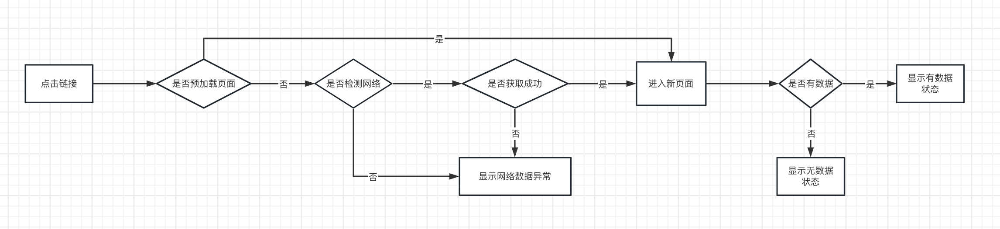
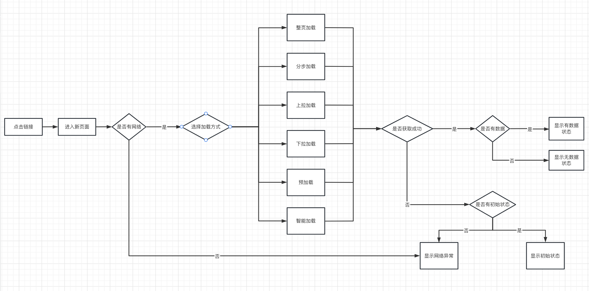

# 产品
### 前言
记录产品相关的技能树&产品思考
### 基本工具掌握
> 不定期更新中。。。
#### axure 产品原型设计工具
[axure教程](https://www.axure.com.cn/axure)

##### 快捷键

| 基本                                                         | 输出快捷键                                                   | 控件编辑                                                     |
| ------------------------------------------------------------ | ------------------------------------------------------------ | ------------------------------------------------------------ |
| 打开：Ctrl + O 新建：Ctrl + N 保存：Ctrl + S 退出：Alt + F4 打印：Ctrl + P 查找：Ctrl + F 替换：Ctrl + H 复制：Ctrl + C 剪切：Ctrl + X 粘贴：Ctrl + V 快速复制：Ctrl+D&Ctrl+点击拖拽 撤销：Ctrl + Z 重做：Ctrl + Y 全选：Ctrl + A | 下页：Ctrl + Tab 上页：Ctrl + Shift + Tab 关闭当前页：Ctrl + W 垂直滚动： 鼠标滚轮 横向滚动：Shift + 鼠标滚轮 放大缩小：Ctrl + 鼠标滚轮 页面移动：Space + 鼠标右键 隐藏网格：Ctrl + ’ 对齐网格：Ctrl + Shift + ’ 隐藏全局辅助线：Ctrl + . 隐藏页面辅助线：Ctrl + , 对齐辅助线：Ctrl + Shift + , 锁定辅助线：Ctrl + Alt +, | 群组：Ctrl + G 取消群组：Ctrl + Shift + G 上移一层：Ctrl + ] 置于顶层：Ctrl +Shift + ] 下移一层：Ctrl + [ 置于底层：Ctrl + Shift + [ 左对齐：Ctrl + Alt +L 居中对齐：Ctrl + Alt + C 右对齐：Ctrl + Alt + R 顶端对齐：Ctrl + Alt + T 垂直居中对齐：Ctrl + Alt + M 底端对齐：Ctrl + Alt + B 水平分布：Ctrl + Shift + H 垂直分布：Ctrl + Shift + U 减少脚注编号：Ctrl + J 增加脚注编号：Ctal + Shift + J 锁定位置和尺寸：Ctrl + K 解锁位置和尺寸：Ctrl + Shift + K |

## 原型实例

> 以xx产品为例，将页面功能重排
### 需求文档
产品需求文档包含：
#### 产品介绍
##### 产品简介
    1. 说明产品使用价值：1）产品简短概括；2）产品提供的服务；3）产品核心竞争力
    2. 目标用户&使用场景：1）用户群分析；2）使用场景分析
    3. 行业概述：1）行业现状简述；2）未来发展趋势；3）竞品分析
##### 版本说明
    | 版本号 | 平台 | 完成日期 |
    |---|---|---|
    | v1.0.0 |  |  |
##### 交互说明（交互自查表）
    | 层次 | 角度 | 交互自查点 | 是否完成 |
    |------|------|------------|----------|
    |      |      |            |          |
    |      |      |            |          |
    |      |      |            |          |
    |      |      |            |          |
#### xx产品-版本说明
##### 产品概览
- 更新/修改日志
    | 修改时间 | 版本 | 属性 | 描述 | 修改人 |
    |----------|------|------|:-----|:-------|
    |          |      |      |      |        |
    |          |      |      |      |        |
- 需求列表
   
- 排期表
    | 任务项 | 开始时间 | 结束时间 | 结束时间 | 工期 | 交付物 | 负责人 | 状态 | 排期详情 |
    |--------|----------|----------|:---------|:-----|:-------|:-------|:-----|:---------|
    |        |          |          |          |      |        |        |      |          |
##### 产品架构
- 产品结构图
    > 用思维导图把产品的各个页面罗列出来（注：不需要罗列内容）
- 信息结构图
    > 用思维导图将产品的动态数据罗列出来（注：非动态数据不需要罗列）
- 业务流程图
    > 用泳道图梳理业务流程（注：保证逻辑完整性）
- 页面流程图
    > 用原型展示用户视角下操作产品的流程（注：明确每个页面的元素）
- 产品原型
    - 全局说明
    - 前端原型
    - 后台原型
    - 其他原型
- 非功能需求
    - 埋点需求
    - 性能需求
    - 兼容性需求
##### 产品原型
- 全局说明
    - 角色/功能权限
        | 功能/角色 | 角色1 | 角色2 | 角色... |
        |-----------|-------|-------|:--------|
        |           |       |       |         |
    - 加载方式
        > 页面数据加载模式：
        1. 先获取数据再显示页面「预先加载下一个页面数据」
        
        2. 先显示页面再获取数据
        
        > 常见加载方式：
        - 整页加载
        使用：整页加载保证每个页面的完整性，体验比较顺畅
        场景：全屏查看多图
        ⚠️：页面数据过大加载效率低，影响使用体验
        - 分步加载
        使用：根据页面信息的重要等级先后加载，一般先加载页面框架/文字（页面滚动到哪儿加载到哪儿）
        场景：数据较多的页面，如网站首页、数据较大的活动页
        ⚠️：可能会丢失掉某些重要信息
        - 下拉加载
        使用：下拉操作+loading动画刷新页面，方便用户刷新界面
        场景：
        ⚠️：
        - 上拉加载
        作用：下拉操作+loading动画加载页面获取新内容，让用户代入无尽浏览模式，
        使用场景：瀑布流、长列表
        ⚠️注意：信息过多容易迷失，不便快速定位到某一内容
        - 预加载
        作用：用户在上一级页面等待时就将下一页面数据加载好
        使用场景：下一页面数据量不大，不会产生大量的流量消耗
        ⚠️注意：避免加载大量数据造成流量大量消耗
        - 智能加载
        作用：非wifi网络下优先加载文字/页面框架，wifi网络下加载所有资源
        使用场景：加载数据过大时，根据不同的网络场景使用不同的加载模式
        ⚠️注意：不一定真实有效地命中用户需求
    - 全局弹层
        > 列出公用弹层样式，并说明触发条件
    - 常用字段
        
        | 功能 | 字段名称 | 是否必填 | 数据类型 | 字段长度 | 数据区间 | 初始键盘 | 提示文字 | 缺省值 | 其他规则 |
        |------|----------|----------|:---------|:---------|:---------|:---------|:---------|:-------|:---------|
        |      |          |          |          |          |          |          |          |        |          |
    - 网络异常
        - 网络切换
        - 断网情况
        - 弱网情况
    - 全局交互
        > 列出全局交互方式
- 前端原型
    > 页面布局规则、交互规则、数据规则
- 后台原型
- 其他原型
##### 非功能需求
- 埋点需求
    > 用户操作数据留存&说明：如页面打开率、按钮点击率
- 性能需求
    > 请求数据德响应要求、并发数要求
- 兼容性需求
    > 包含：系统版本支持、产品版本控制、多终端支持、浏览器支持
如何写一份完整的需求文档？
[需求文档](https://www.woshipm.com/pd/5124922.html)

[需求分析](https://www.woshipm.com/pd/4143186.html)
以xxx产品为例，编写产品需求文档

#### Tableau 数据可视化
[tableau 教程](https://zhuanlan.zhihu.com/p/500983855)
#### 产品流程图-示例未补充
> 业务流程图：描述管理系统内各单位、人员之间的业务关系，作业顺序和管理信息流向的图表。

##### 业务流程图

> 梳理业务

1. 基本流程图

   > 基本流程图：主要用来描述各角色在处理某个事项的流程

2. 跨职能流程图 即 泳道图（使用较多）

   > 描述的是多个角色同时处理某个事项的流程

   绘制方法

   - 列出参与该流程的角色，之于白板左边/上方（包含输入、输出）
   - 将各流程的步骤列出来并放置在对应的泳道上

3. - ​

##### 任务流程图

> 梳理用户操作行为。从整体流程到局部流程，从主干流程到分支，从正常流程到异常流程

##### 页面流程图

> 梳理个个页面之间的跳转关系。清晰表现点击位置，再连接到跳转目标页面，页面连接由:页面、行动点、连接线组成

##### 其他

时序图

> 时序图：描述对象之间的传递消息的时间顺序, 即用例中的行为顺序

绘制：

- 对象: 时序图中对象使用矩形表示, 并且对象名称下有下划线
- 生命线: 生命线是一条垂直的虚线. 表示时序图中的对象在一段生命周期内存在
- 消息: 两个对象之间的单路通信. 从发送方指向接收方. 在时序图中很少使用返回消息
- 激活: 时序图可以描述对象的激活和钝化. 激活表示该对象被占用以完成某个任务. 钝化指对象处于空闲状态, 等待消息. 在 UML 中, 对象激活时将对象的生命线拓宽为矩形来表示的

##### 示例

业务描述：
用户行为：
页面跳转：

[泳道图，时序图](https://blog.csdn.net/az44yao/article/details/108715984)
[业务流程图](https://baijiahao.baidu.com/s?id=1639393321744449722&wfr=spider&for=pc)

#### 项目管理|需求池-需求管理模板

##### 需求整理

- 需求收集

  > 需求收集：收集时关注需求所服务的用户以及需求提出的场
  >
  > 便于进一步理解需求，挖掘需求本质

##### 需求分类

主要有三类：

- BUG：影响用户对产品的正常使用
- 优化类：不影响功能的实现，但是影响用户体验，久而久之将产生消极影响
- 新需求：用户希望实现的新功能或是产品规划中的新功能

##### 需求优先级确认

- KANO模型

  > KANO模型：对用户需求分类和优先排序的有用工具,以分析用户需求对用户满意的影响为基础，体现了产品性能和用户满意之间的非线性关系。

  a. 基本需求：提供此需求，用户满意度不会提升，不提供此需求，用户满意度大幅度下降
  b. 期望需求：提供此需求，用户满意度提升，不提供此需求，用户满意度下降
  c. 兴奋需求：用户意想不到的，提供此需求，用户满意度大幅度提升，不提供此需求，用户满意度不会下降
  d. 无差异需求：无论是否提供此需求，用户满意度都不会改变
  e. 反向需求：提供后用户满意度反而下降的需求
  尽量避免无差异需求、反向需求

  优先级排序：基本需求>期望需求>兴奋需求

- 四象限法则

  > **重要紧急>重要不紧急>紧急不重要>不重要不紧急**

- 波士顿矩阵分析法

[构建需求池](https://zhuanlan.zhihu.com/p/106591292)
[正确使用需求池](https://baijiahao.baidu.com/s?id=1655128817038675832&wfr=spider&for=pc)

### 产品思考
toB
toC

### 产品分类&竞品分析

